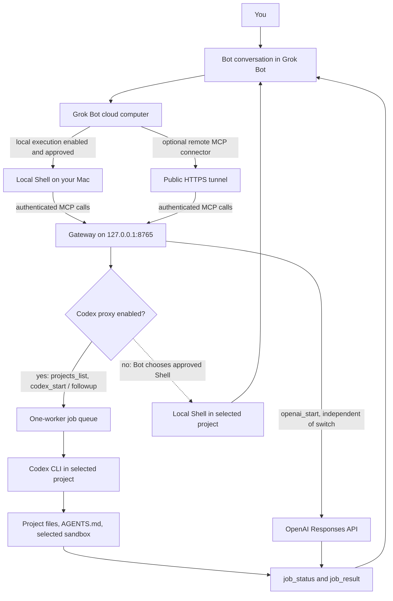

# Grok Codex Gateway

Ask a Bot in the Grok Bot app to work on a project on your Mac, and let Codex carry out the task in that project's directory. This gateway connects the conversation to the local Codex command-line program, tracks the task, and returns its result to the Bot.

For example, you can ask:

> Review the uncommitted changes in `example-app`. Use Codex, report any bugs, and do not edit files.

The Bot finds the project through the gateway, starts a read-only Codex job, and brings the findings back to your conversation. You can then ask a followup in the same Codex session.

The gateway and Codex process run on your Mac; model inference uses the corresponding online service. Each new task starts a separate Codex session. Followups resume sessions created through the gateway; they do not insert messages into an already-open Codex or ChatGPT UI conversation.

## The pieces involved

| Component | What it does |
| --- | --- |
| **Grok Bot** | The app and Bot conversation where you describe the task and receive the answer. Its cloud computer is separate from your Mac. |
| **MCP gateway** | This repository's local server. MCP means **Model Context Protocol**: a standard way for an AI client to discover and call tools. Here, those tools list projects, start Codex jobs, and retrieve results. |
| **Codex CLI** | The locally installed Codex command-line program. It inspects or edits the selected project using its own login, configuration, project instructions, and sandbox. |
| **`AGENTS.md`** | A Markdown file containing instructions for coding agents, such as how to build a project and which checks to run. Its presence is one way the gateway recognizes an eligible project. |
| **[Ganglia](https://github.com/GMusliaj/ganglia), optional** | A separate Markdown knowledge store for lessons, decisions, and project notes across repositories. The gateway can use its project folders to discover projects. [The Ganglia example below](#optional-discovery-through-ganglia) explains the layout and its limits. |

The **Codex proxy** is the gateway's on/off switch for delegating project tasks to Codex. When it is disabled, the Bot can instead work through Grok's approved local Shell, which runs commands on your Mac. That fallback is chosen by the Bot; the gateway does not execute it.

## Quick start

### 1. Prepare the local tools

You need macOS/POSIX, nvm, and an installed, authenticated `codex` CLI. The project pins its Node.js version in `.nvmrc`. Sign in to Codex locally using its supported login flow before requesting Codex work.

Run these commands from this checkout:

```sh
source "$HOME/.nvm/nvm.sh"
nvm install
nvm use
npm ci
npm run setup
```

Setup creates two private files outside the source checkout:

| File | Purpose |
| --- | --- |
| `~/.config/grok-codex-gateway/config.json` | Project discovery roots, port, and backend settings. |
| `~/.config/grok-codex-gateway/mcp.token` | The bearer token authenticating MCP requests. Anyone with it can use this gateway. |

Setup does not replace existing files or print the token. It creates the files with mode `0600`, meaning only their owner can read or write them. Keep credentials and private configuration outside Git. `GATEWAY_CONFIG_DIR` can select a different private configuration directory outside a repository.

### 2. Check which projects are available

The initial configuration searches your home directory. For a smaller search, edit `roots` in the private `config.json` to point to your project directories, for example `["~/work"]`.

```sh
npm run projects
```

This prints the eligible projects, their IDs, and discovery warnings. A project needs its own `AGENTS.md` or a matching Ganglia project entry. [Project discovery](#project-discovery) explains both routes; **Ganglia is optional**.

### 3. Start the gateway

In the same Terminal window:

```sh
caffeinate -dimsu npm start
```

Leave this running. `caffeinate` keeps the Mac awake while the gateway runs; Control-C stops it. The default MCP endpoint is:

```text
http://127.0.0.1:8765/mcp
```

### 4. Connect Grok Bot from this Mac

Enable **Execution on Local Computer** in **Settings → General → Bot**. For accounts with registered computers, this setting moves to **Settings → Computer → Computers → Execution on this computer**. Shell execution follows your local-computer approval policy and any stricter team policy. See [Grok's local-computer permissions](https://docs.x.ai/grok-bot/approvals-security-and-privacy#control-access-to-your-local-computer).

The Bot's approved local Shell must use an MCP client to call the endpoint above. The client reads `mcp.token` from its private file at call time and sends its contents in the `Authorization: Bearer …` header. It must keep the token out of command output, chat, and saved task files. This repository provides the server; it does not install a Grok plugin or a local client command.

Verify the connection with MCP `initialize`, `tools/list`, and a harmless `projects_list` call. A health check alone does not verify authentication or tool access.

Because the Shell and gateway run on the same Mac, this route needs no tunnel. Grok's **cloud** connector cannot reach your Mac's `localhost`; use the [optional remote connection](#optional-remote-connection) if the caller cannot run local Shell commands.

## Worked example: review a local project

Suppose your project is at `~/work/example-app`, it contains an `AGENTS.md`, and `~/work` is one of your configured roots. Ask the Bot:

> Review the uncommitted changes in `example-app`. Use Codex, report any bugs, and do not edit files.

The following JSON blocks are **MCP tool arguments**, not shell commands. The Bot sends them through its MCP client.

1. Call `proxy_status` with `{}` to check whether Codex delegation is enabled.
2. Call `projects_list` with `{}`. Find `example-app` in the returned `projects` array and use its `id`. The gateway supplies the path; the start request takes an ID, never a filesystem path.
3. Call `codex_start`, replacing the project placeholder with that returned ID:

```json
{
  "project": "PROJECT_ID_FROM_PROJECTS_LIST",
  "prompt": "Review the uncommitted changes and report bugs with file references. Follow AGENTS.md. Do not edit files.",
  "mode": "read-only",
  "requestId": "review-example-001"
}
```

The gateway checks the project's eligibility and returns a `jobId` with state `queued`. When its turn arrives, it checks eligibility again and runs Codex in that project directory.

4. Call `job_status` with the returned job ID to check progress:

```json
{
  "jobId": "JOB_ID_FROM_CODEX_START"
}
```

Once the state is `completed`, call `job_result` with the same arguments. Its `result` contains Codex's final text, which the Bot presents in your conversation. If the state is `failed`, `cancelled`, or `timed_out`, report that state and any error instead of claiming success.

5. To continue a completed, retained Codex job, call `codex_followup`:

```json
{
  "jobId": "JOB_ID_FROM_CODEX_START",
  "prompt": "Explain the highest-impact finding and suggest a fix. Do not edit files.",
  "requestId": "review-example-002"
}
```

A followup returns a **new job ID** while retaining the original project's Codex session and sandbox mode. Check its status and result in the same way. To move from review to editing, start a new job with the appropriate write mode and explicit permission to edit.

Every start or followup needs a `requestId`. Retrying the identical request with the same ID returns the existing job while it is retained. Reusing that ID for different arguments is rejected. Use a new ID for intentional new work.

## Project discovery

Configured **`roots`** are the directories the gateway is allowed to search for projects. A directory under a root becomes eligible through either of the following routes.

### Discovery through `AGENTS.md`

A project's own `AGENTS.md` identifies it as a project. If the file is inside a Git checkout, discovery lists the nearest containing checkout. Codex still applies nested instructions only in their respective file scopes.

For example:

```text
~/work/
└── example-app/
    ├── .git/
    ├── AGENTS.md
    └── src/
```

With `"roots": ["~/work"]`, this project can appear in `projects_list` without Ganglia. A home-level `AGENTS.md` supplies global guidance; it does not enroll every directory in your home folder.

### Optional discovery through Ganglia

**[Ganglia](https://github.com/GMusliaj/ganglia) is a portable knowledge store made of Markdown files for AI agents.** It keeps reusable lessons and decisions across projects, with private project notes under `local/projects/`. Its separately installed `$remember` skill saves knowledge, and `$recall` searches it. A skill is a set of instructions an agent follows to perform a task. See [Ganglia's README](https://github.com/GMusliaj/ganglia#readme) for its setup and privacy boundaries; this gateway does not bundle or install it.

Ganglia provides a second way to identify projects, including projects without their own `AGENTS.md`. Consider this illustrative layout:

```text
~/work/
└── example-app/                         Project source directory
    ├── .git/
    └── src/

~/ganglia/
└── local/
    └── projects/
        └── example/                    Ganglia project entry
            └── decisions.md            An existing Markdown knowledge file
```

Here, `example` is the **project slug**: the folder name used for that project's knowledge. It differs from the source directory name, `example-app`, so an explicit mapping connects them. Merge these values into the private `config.json`:

```json
{
  "roots": ["~/work"],
  "gangliaRoot": "~/ganglia",
  "gangliaMappings": {
    "example": "~/work/example-app"
  }
}
```

`gangliaRoot` locates the knowledge store. `gangliaMappings` maps a knowledge folder's slug to its actual project directory. The mapping is valid only if the Ganglia entry contains an existing Markdown knowledge file and the target is a real, permitted directory under `roots`. A mapping alone does not create or enroll a project.

Without a mapping, discovery tries to match the slug to a Git checkout with the same directory name or a directory directly under a root. A container with one uniquely identifiable nested Git checkout can resolve to that checkout. Multiple possible matches require an explicit mapping. Entries containing only session transcripts or checkpoints do not qualify.

**Discovery checks names and file metadata; it does not read the note text.** In this example, the presence of `decisions.md` can establish eligibility, but its contents are not sent to the Bot or injected into Codex. To retrieve past decisions, Codex must use the installed `$recall` skill as a separate action. The gateway never writes to Ganglia or reads raw archives, credentials, or transcripts during discovery. Another system's memory index alone does not enroll projects.

If Ganglia is absent, `AGENTS.md` discovery still works; the project listing reports a Ganglia availability warning.

### Search limits and validation

Hidden, dependency, build, raw-archive, and system directories are skipped. Symlinked project paths are rejected. Discovery scans breadth-first, with limits of 10,000 directories, 5,000 entries per directory, and the configured depth. Warnings report incomplete searches; use narrower roots to reach projects beyond a limit.

Project names and paths are returned only to authenticated MCP callers. The gateway validates eligibility when accepting a task and again before starting its worker.

## Sandbox modes and permissions

A **sandbox mode** controls what the Codex job is allowed to do. Select it when starting the task:

| Mode | Use it for |
| --- | --- |
| `read-only` | Inspection, reviews, and explanations. This is the default. |
| `workspace-write` | Explicitly authorized edits to project files. |
| `workspace-write-git` | An authorized task that also needs Git metadata writes, such as a commit or branch, or outbound network access, such as `git push` or `gh`. |

`workspace-write-git` uses Codex's workspace-write sandbox, explicitly adds the selected project and its `.git` directory as writable roots, and enables outbound network access for that job. Only this mode receives the gateway's `SSH_AUTH_SOCK`, when set, so Git can use its SSH agent. Followups retain their selected mode.

Codex keeps its login, user/project configuration, `AGENTS.md` instructions, and execution rules. The gateway sets `approval_policy="never"`: operations needing additional approval are denied. A request's write mode does not authorize a commit, deployment, or other action beyond the user's task. Perform approval-dependent work through an interactive local Codex session.

The gateway offers no full-access mode or arbitrary shell-command tool. Trusted Codex MCP integrations have their own permissions; the CLI filesystem sandbox does not govern every external tool. The listener binds only to `127.0.0.1`, checks Host and Origin, and requires bearer authentication for MCP. All token holders share the same jobs and account access: this is a service for one trusted owner, not a multi-user service.

## Codex proxy switch and direct Shell fallback

Read `proxy_status` to see `enabled`, the selected `execution` backend, and manual-only credit detection. Use `proxy_set_enabled` with:

```json
{"enabled": false}
```

This stops accepting new Codex starts and followups. The Bot should then use Grok's approved local Shell directly in the selected project, following its `AGENTS.md` and the user's authorization. Switching does not launch Shell work or cancel accepted jobs. Queued and running jobs continue; retries of accepted requests, status, results, and cancellation remain available.

Call the same tool with `{"enabled": true}` to resume delegation. `projects_list.backends.codex` reflects the switch. Changes take effect without restart and persist in owner-only `proxy-state.json` beside the private configuration. Missing state defaults to enabled; invalid or unreadable state blocks startup. A failed persistence write leaves the current mode unchanged and returns an error.

The gateway cannot read subscription balances or reliably detect exhausted credits. Rate limits, network failures, login problems, and credit exhaustion can produce indistinguishable CLI errors. Check your account separately and switch manually when needed.

Suggested saved Bot instructions:

> Check the Codex proxy status before project work. When enabled, use the local MCP gateway to discover the project, delegate to Codex, and retrieve the result. When disabled, use approved local Shell execution in the discovered project directory. Follow that project's AGENTS.md, preserve project eligibility checks and user authorization, and obtain Shell approval as required. Use the local endpoint without a tunnel. Read the bearer token from its private file at call time and never print or paste it into chat.

The gateway cannot change Grok account settings, save these instructions for you, or grant local Shell permission. If Codex is unavailable, switch the proxy off explicitly; there is no automatic failover.

## Configuration reference

This is an example of the supported configuration keys with their default values. Setup omits `maxDepth` and `codexBin`; loading the configuration supplies those defaults.

```json
{
  "roots": ["~"],
  "gangliaRoot": "~/ganglia",
  "gangliaMappings": {},
  "maxDepth": 6,
  "port": 8765,
  "allowedHosts": [],
  "allowedOrigins": [],
  "codexBin": "codex",
  "jobTimeoutMinutes": 30
}
```

| Setting | Meaning |
| --- | --- |
| `roots` | Directories to search. Paths must be absolute or start with `~/`; `~` selects your home directory. |
| `gangliaRoot` | The optional Ganglia installation's location. The configured default is checked even if Ganglia is absent. |
| `gangliaMappings` | Explicit links from Ganglia project slugs to source directories under `roots`. |
| `maxDepth` | Search depth below each root; default `6`, allowed range `0–20`. |
| `port` | Local listener port; default `8765`, allowed range `1024–65535`. Binding remains loopback-only. |
| `allowedHosts` | Additional permitted HTTP Host values, used for tunnels. Local Host values with the configured port are added automatically. |
| `allowedOrigins` | Exact HTTP(S) origins permitted when a client sends an Origin header. |
| `codexBin` | Codex executable name or path. |
| `codexModel`, optional | Selects a Codex model; otherwise existing Codex configuration decides. |
| `openaiModel`, optional | Selects the model for the separate OpenAI text backend. |
| `jobTimeoutMinutes` | Per-job timeout; default `30`, allowed range `1–120`. |

Restart the gateway after editing `config.json`. Proxy switching is the exception: use its MCP tool without restarting.

## MCP tool reference

| Tool | Arguments | Purpose |
| --- | --- | --- |
| `projects_list` | `{}` | List eligible projects, warnings, and configured backend status. |
| `proxy_status` | `{}` | Read the Codex proxy switch and selected execution backend. |
| `proxy_set_enabled` | `enabled` | Persistently enable or disable Codex delegation. |
| `codex_start` | `project`, `prompt`, `mode`, `requestId` | Start a Codex task; `mode` defaults to `read-only`. |
| `codex_followup` | `jobId`, `prompt`, `requestId` | Continue a completed, retained Codex job with a session ID. |
| `openai_start` | `prompt`, `requestId` | Start an independent OpenAI text request. |
| `job_status` | `jobId` | Read progress and job state. |
| `job_result` | `jobId` | Read final text when the job is completed. |
| `job_cancel` | `jobId` | Cancel queued work or terminate a running worker. |

One worker runs at a time across all projects and both backends. Up to 10 unfinished jobs are accepted, and up to 100 jobs are retained, with finished jobs removed first when capacity is needed. Prompts are limited to 32,000 characters, HTTP bodies to 128 KiB, and worker output to 1 MiB. Cancellation waits for the worker to close and terminates its process group; it does not undo edits already made.

Jobs and retry records live in memory. Restarting loses them, and graceful shutdown cancels unfinished work. Codex's own sessions may remain on disk under its retention policy, but the gateway does not replay lost jobs or adopt arbitrary existing sessions.

## Optional OpenAI text backend

For standalone text requests, set `openaiModel` to a model available to your API account and supply `OPENAI_API_KEY` through the gateway process's local environment or secret manager. Restart after configuring it, then use `openai_start` and the usual job status/result tools.

This backend calls the OpenAI Responses API with `store: false`, no tools, no automatic retries, and a 4096-token output ceiling. It receives the prompt, not project files. It works independently of the Codex proxy switch, and its API key is not passed to Codex's child process.

API access and billing are separate from the Codex worker's login. The gateway does not read browser cookies, borrow a ChatGPT UI conversation, or implement the optional Sign in with ChatGPT OAuth integration.

## Optional remote connection

Use a tunnel when the caller runs remotely and cannot use local Shell. A tunnel forwards a public HTTPS address to the gateway's local port. Grok's cloud connector cannot directly reach loopback or private-network addresses; see [Grok's MCP tunneling documentation](https://docs.x.ai/grok/connectors/custom-mcp-tunneling).

For example, after installing and configuring ngrok separately:

```sh
ngrok http 8765
```

Then:

1. Add the tunnel's actual Host to `allowedHosts`, without a scheme or path. Include a port only if the request's Host contains it.
2. If the client sends Origin, add its exact scheme, host, and port to `allowedOrigins`. Restart the gateway.
3. Set the remote MCP connector URL to `https://YOUR_TUNNEL_HOST/mcp`.
4. Configure bearer authentication through the client's secret/credential field, using the contents of `mcp.token`. Keep the token out of URLs, prompts, documentation, and Git.
5. Verify `initialize`, `tools/list`, and `projects_list` through the public endpoint. Keep the Mac, gateway, and tunnel running.

Use exact hosts and origins; do not disable authentication or use wildcards. This server uses a static bearer token rather than OAuth. A client that only supports OAuth needs an appropriate authenticating proxy. Custom remote MCP plugin access remains subject to Grok account and team policy.

## Architecture

The two connection routes reach the same local server. Direct Shell fallback bypasses the gateway worker; OpenAI text is a separate backend.



## Verification

```sh
source "$HOME/.nvm/nvm.sh"
nvm use
npm run check
npm audit --include=dev
```

Tests cover authenticated MCP exchanges, project eligibility, retry deduplication, serialized jobs, cancellation and timeout, proxy switching, child-process boundaries, and mocked OpenAI requests. They use fixture projects and workers; they do not spend API credits, read real credentials, or inspect real project contents. Live model execution and access from a particular Grok account require separate verification.

## License and credits

Original source, tests, and documentation in this repository are copyright 2026 Gezim Musliaj and licensed under the Apache License, Version 2.0. See [LICENSE](LICENSE), [NOTICE](NOTICE), and [CREDITS.md](CREDITS.md) for the terms and attribution for the author and every pinned third-party package.

Third-party packages retain the licenses in their own distributions. These files do not grant rights in Codex, Grok Bot, OpenAI, or their names.

## Official integration references

- [Grok Bot computer and local execution](https://docs.x.ai/grok-bot/computer-and-apps)
- [Grok Bot approvals and local-computer permissions](https://docs.x.ai/grok-bot/approvals-security-and-privacy)
- [Grok Bot custom MCP plugins](https://docs.x.ai/grok-bot/team-bots)
- [Grok local MCP tunneling](https://docs.x.ai/grok/connectors/custom-mcp-tunneling)
- [xAI API remote MCP](https://docs.x.ai/developers/tools/remote-mcp)
- [OpenAI text generation and Responses](https://developers.openai.com/api/docs/guides/text)
- [Codex app-server and Sign in with ChatGPT integration](https://developers.openai.com/siwc/token-sharing-open-source/codex-app-server)
- [Official MCP TypeScript SDK](https://github.com/modelcontextprotocol/typescript-sdk)
